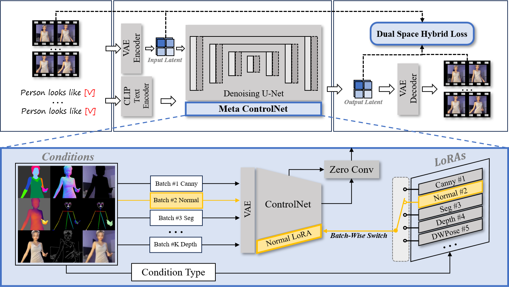

# Meta-Animator

**Meta-Animator** is a modular and efficient human image animation framework based on diffusion models. It supports few-shot fine-tuning with lightweight LoRA modules and enables high-quality, identity-preserving video generation from reference images.


📄 **[Project Page](https://MetaAnimator.github.io)**

## 🧠 Abstract

Human Image Animation plays a vital role in interactive entertainment, film industry, and game development, where lifelike character motion can significantly enhance user immersion and creative flexibility. It aims to animate a static human image according to a driving pose sequence.

While recent diffusion-based methods have achieved impressive quality, they often rely on large-scale datasets and heavy architectural modifications. We propose Meta-Animator, a framework that integrates meta-learning and DreamBooth-style fine-tuning for efficient, identity-preserving animation. At its core, Meta-Animator introduces a set of curated Meta-Tasks designed to guide the model in learning complementary foreground, background, and global features from reference images. These tasks are implemented via Meta ControlNet, which employs condition-specific LoRA modules for multi-task training without altering the backbone architecture. In addition, the proposed Dual Space Hybrid Loss bridges the latent and image spaces, effectively enhancing semantic integrity and facial detail preservation.

Meta-Animator achieves competitive performance using only a small-scale public dataset, requiring over 20× less data and 500× fewer training steps than leading baselines. Its modular design supports multi-reference fine-tuning and is compatible with large-scale video generation models. Extensive experiments demonstrate the framework's strong animation capability.

<p align="center">
  
</p>

<p align="left">
  <em>
    The proposed Meta-Animator framework. Meta-Animator integrates Meta ControlNet, which leverages condition-specific LoRAs to enable multi-task learning within a single model. During training, each batch is assigned a specific task, with the corresponding LoRA dynamically integrated into ControlNet for gradient computation and parameter updates. The process iterates across tasks, allowing the model to learn diverse conditions simultaneously.
  </em>
</p>

---

## 🔧 Environment Requirements

- Python >= 3.10  
- PyTorch >= 2.3.1  
- (Optional) CUDA-compatible GPU for accelerated training and inference

You can set up the environment using `conda` or `pip`. For example:

```bash
conda create -n meta_animator python=3.10
conda activate meta_animator
pip install torch==2.3.1 torchvision torchaudio
pip install -r requirements.txt
````

## 🗂 Project Structure

* `Step0_train_BaseCtrl_LoRA.sh` — Stage 1: Train base ControlNet with condition-specific LoRA.
* `Step1_train_Motion_Module.sh` — Stage 2: Train the motion module.
* `Step2_finetune_BaseCtrl_LoRA.sh` — Stage 3: Fine-tune the model on a reference image set.
* `extract_LoRA_weights.sh` — Export trained LoRA weights for modular reuse or deployment.
* `Step3_sample.sh` — Run inference using the trained model to generate animation.

## 🚀 Training & Inference Pipeline

1. **Train Base ControlNet with LoRA:**

   ```bash
   bash Step0_train_BaseCtrl_LoRA.sh
   ```

2. **Train the Motion Module:**

   ```bash
   bash Step1_train_Motion_Module.sh
   ```

3. **Fine-tune on a Reference Set (Few-shot):**

   ```bash
   bash Step2_finetune_BaseCtrl_LoRA.sh
   ```

4. **(Optional) Extract LoRA Weights Separately:**

   ```bash
   bash extract_LoRA_weights.sh
   ```

5. **Inference (Generate Animation):**

   ```bash
   bash Step3_sample.sh
   ```

## 📌 Notes

* Ensure that all dataset paths and configuration files are correctly set before running the scripts.
* For best performance, fine-tune with at least 5 high-quality reference images.
* The output animations will be saved in the `outputs/` directory by default.
